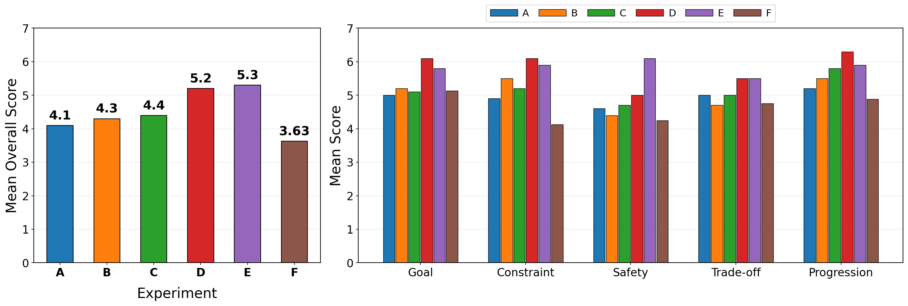

# PlanFit


`PlanFit` is an experimental repository focused on **4-week personalized hybrid training plan generation**, aiming to **expose the limitations of small LLMs in multi-objective planning tasks** and evaluate how much structured prompting and workflow design can mitigate those limitations.

The core objective of this project is not to show that “workflow always improves performance,” but rather to verify that **multi-objective planning is particularly challenging for small models, and that the effectiveness of improvements varies depending on model capacity**.

---

## Documentation Convention

This README and the actual execution labels follow the same condition ordering:

- `A`: `Qwen3-0.6B` direct  
- `B`: `Qwen3-1.7B` direct  
- `C`: `Qwen3-1.7B` structured  
- `D`: `Qwen3-14B-AWQ` direct  
- `E`: `Qwen3-1.7B` workflow  
- `F`: `Qwen3-0.6B` workflow  
- `G`: `Qwen3-0.6B` structured ablation  
- `H`: `Qwen3-14B-AWQ` structured ablation  

----- extra work -----
- `I`: `Qwen3-1.7B` refined workflow  
- `J`: `Qwen3-0.6B` refined workflow  
- `K`: `Qwen3-1.7B` dynamic multi-agent workflow
- `L`: `Qwen3-0.6B` dynamic multi-agent workflow

---

## Research Questions

1. In multi-objective tasks such as personalized hybrid training plan generation, how does planning performance vary depending on **model size** and **prompting strategy** (`direct` vs. `structured`)?
2. Can **workflow-based system design** improve planning performance? In particular, is the effect more pronounced in compact models?
3. Can a **dynamic multi-agent workflow** that routes only failure-specific revisions outperform a fixed workflow, especially for compact models?

---

## Fixed Experimental Scope

- Task: 4-week personalized hybrid training plan generation  
- Core rubric: `Constraint`, `Safety`, `Goal alignment`, `Trade-off`, `Coherence`  
- Output schema: `Week / Day / Focus / Session / Duration / Intensity / Reason`  
- Evaluation protocol: blind human scoring + separated quantitative/qualitative analysis  

---

## Main Experimental Conditions

In this study, workflow conditions are defined as `E/F`, and `A–D` form the main comparison block.

| Condition | Model | System | Purpose |
| --- | --- | --- | --- |
| `A` | `Qwen3-0.6B` | Direct planner | Tiny model direct baseline |
| `B` | `Qwen3-1.7B` | Direct planner | Small model direct baseline |
| `C` | `Qwen3-1.7B` | Structured planner | Prompt structuring baseline |
| `D` | `Qwen3-14B-AWQ` | Direct planner | Strong local reference |
| `E` | `Qwen3-1.7B` | LangGraph workflow planner | Workflow intervention on small model |
| `F` | `Qwen3-0.6B` | LangGraph workflow planner | Evaluating workflow limits on tiny model |

---

## Structured Ablation Conditions

| Condition | Model | System | Purpose |
| --- | --- | --- | --- |
| `G` | `Qwen3-0.6B` | Structured planner | Tiny-model structured ablation |
| `H` | `Qwen3-14B-AWQ` | Structured planner | Strong-model structured ablation |

Main reading order:

**A → B → C → D → E → F**

---

## Additional Experiments

| Condition | Model | System | Purpose |
| --- | --- | --- | --- |
| `I` | `Qwen3-1.7B` | LangGraph refined workflow planner | Effect of refined workflow on 1.7B |
| `J` | `Qwen3-0.6B` | LangGraph refined workflow planner | Effect of refined workflow on 0.6B |
| `K` | `Qwen3-1.7B` | Dynamic multi-agent workflow planner | Dynamic routing effect on 1.7B |
| `L` | `Qwen3-0.6B` | Dynamic multi-agent workflow planner | Dynamic routing effect on 0.6B |

Key refinements in `I/J`:

- Strips leaked `<think>` blocks from node outputs before storing final artifacts.
- Passes the full persona context to each workflow node instead of relying only on partial state.
- Uses node-specific generation settings, with deterministic checkers and reviser stages for more stable verification and formatting.

Key characteristics of `K/L`:

- Uses the same front-end planning stages, then routes failures dynamically instead of relying on a single reviser to absorb all revisions at once.
- Activates only the relevant fixer agents (`safety`, `constraint`, `trade-off`) when the corresponding checker fails.
- Tracks routing decisions and triggered fixers for later analysis.

---

## Workflow Definition

Recommended workflow:

1. `profile extractor`  
2. `goal prioritizer`  
3. `draft planner`  
4. `safety checker`  
5. `constraint checker`  
6. `trade-off checker`  
7. `final integrator / formatter`  

Dynamic multi-agent variant (`K/L`):

1. `profile extractor`
2. `goal prioritizer`
3. `draft planner`
4. `metric checkers`
5. `router`
6. `failure-specific fixer agents`
7. `re-check`
8. `final plan`

---

## Key Comparisons

- `A` vs `B` vs `D`: Model size scaling  
- `A` vs `G`, `B` vs `C`, `D` vs `H`: Structured vs direct prompting  
- `E` vs `B/C`: Workflow effect on 1.7B  
- `F` vs `A/G`: Workflow effect on 0.6B  
- `I` vs `K`: Refined fixed workflow vs dynamic multi-agent on 1.7B
- `J` vs `L`: Refined fixed workflow vs dynamic multi-agent on 0.6B
- `D/H` vs others: Gap between strong and compact models  

---

## Metadata

Common fields:

- `prompt_version`
- `temperature`
- `top_p`
- `max_tokens`
- `seed`
- `generated_at`
- `prompt_files`
- `system_type`

Workflow-specific fields:

- `model_calls`
- `checker_fail_count`
- `revision_loops`
- `caught_by_node`
- `remaining_fail_nodes`
- `workflow_nodes`
- `workflow_trace`
- `profile_summary`
- `goal_strategy`
- `safety_review`
- `constraint_review`
- `tradeoff_review`

Dynamic multi-agent specific fields (`K/L`):

- `initial_fail_nodes`
- `routing_trace`
- `fixer_calls`
- `fixers_triggered`

---

## Experiment Scale

- Main: `10 personas × A–F = 60`
- Ablation: `10 personas × G/H = 20`
- Refined: `10 personas × I/J = 20`
- Dynamic multi-agent: `10 personas × K/L = 20`
- Total: `120 outputs`

---

## Model Config

- `tiny = Qwen/Qwen3-0.6B`  
- `small = Qwen/Qwen3-1.7B`  
- `strong = Qwen/Qwen3-14B-AWQ`  

---

## Installation

```bash
pip install -r requirements.txt

# Prepare personas
python src/load_personas.py

# Run each condition
bash scripts/run_condition_a.sh
bash scripts/run_condition_b.sh
bash scripts/run_condition_c.sh
bash scripts/run_condition_d.sh
bash scripts/run_condition_e.sh
bash scripts/run_condition_f.sh
bash scripts/run_condition_g.sh
bash scripts/run_condition_h.sh
bash scripts/run_condition_i.sh
bash scripts/run_condition_j.sh
bash scripts/run_condition_k.sh
bash scripts/run_condition_l.sh
```

Run all main conditions (`A–F`):
```bash
bash scripts/run_all.sh
```

Evaluation:
```bash
python src/evaluate_llm_judge.py \
  --outputs outputs/condition_a/results.jsonl \
  --personas data/processed/personas_normalized.jsonl
```

LLM judge only:

- Score: `1–10`
- Input format:

```json
{
  "id": "P1",
  "name": "Junsu",
  "age": "25",
  "training_background": "...",
  "primary_goal": "...",
  "secondary_goal": "...",
  "schedule_constraint": "...",
  "injury_or_limitation": "...",
  "preferences": "...",
  "dislikes": "..."
}
```
## Results




## Main Message

Multi-objective planning is particularly weak in small LLMs, and the effectiveness of structured prompting and workflow design is strongly dependent on model capacity.

The study first exposes planning differences across model size and prompting strategy, and then evaluates how much workflow-based system design can compensate for these limitations, especially in compact models.

The additional `K/L` experiments further test whether a dynamic multi-agent routing strategy can outperform a fixed workflow by assigning only failure-specific revisions to specialized agents.
